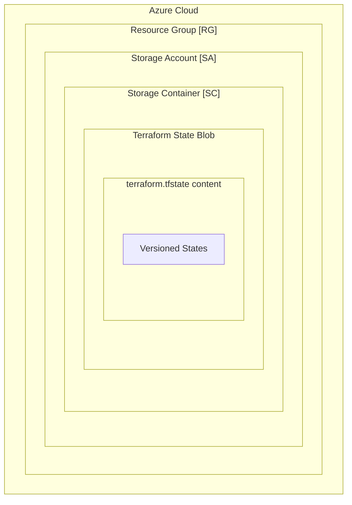

# Azure Terraform State Management Module

This module serves as a robust solution for managing Terraform state in Azure, encapsulating best practices in a simple, reusable module. It automates the provisioning of key Azure resources including a Resource Group, Storage Account, and Container, which are instrumental in managing Terraform state.



Whether dealing with a single Terraform configuration or orchestrating multiple configurations, this module adapts to your needs, ensuring a standardized, secure, and efficient management of Terraform state. Through this module, managing Terraform state in Azure becomes a streamlined process, paving the way for a reliable and organized infrastructure setup.

## Usage

To use this module, simply add the following to your Terraform configuration:

```hcl
module "state_resources" {
    source = "telia-oss/terraform-azure-terraform-init"
    resource_group_name = var.resource_group_name
    location = var.location
    environment = var.environment
    storage_account_name = var.storage_account_name
    container_name = var.container_name
    create_resource_group = true
    create_storage_account = true
}
```

## Resources

| Name                                                                                                                                | Type        |
| ----------------------------------------------------------------------------------------------------------------------------------- | ----------- |
| [azurerm_resource_group.this](https://registry.terraform.io/providers/hashicorp/azurerm/latest/docs/resources/resource_group)       | resource    |
| [azurerm_storage_account.this](https://registry.terraform.io/providers/hashicorp/azurerm/latest/docs/resources/storage_account)     | resource    |
| [azurerm_storage_container.this](https://registry.terraform.io/providers/hashicorp/azurerm/latest/docs/resources/storage_container) | resource    |
| [random_string.azurerm_storage_account](https://registry.terraform.io/providers/hashicorp/random/latest/docs/resources/string)      | resource    |
| [random_string.resource_group](https://registry.terraform.io/providers/hashicorp/random/latest/docs/resources/string)               | resource    |
| [azurerm_resource_group.this](https://registry.terraform.io/providers/hashicorp/azurerm/latest/docs/data-sources/resource_group)    | data source |
| [azurerm_storage_account.this](https://registry.terraform.io/providers/hashicorp/azurerm/latest/docs/data-sources/storage_account)  | data source |

## Inputs

| Name                                                                                                                               | Description                                                                                                       | Type          | Default                                         | Required |
| ---------------------------------------------------------------------------------------------------------------------------------- | ----------------------------------------------------------------------------------------------------------------- | ------------- | ----------------------------------------------- | :------: |
| <a name="input_account_replication_type"></a> [account\_replication\_type](#input\_account\_replication\_type)                     | The replication type for the storage account. Valid options are LRS, GRS, RAGRS, and ZRS.                         | `string`      | `"LRS"`                                         |    no    |
| <a name="input_account_tier"></a> [account\_tier](#input\_account\_tier)                                                           | The performance tier of the storage account. Valid options are Standard or Premium.                               | `string`      | `"Standard"`                                    |    no    |
| <a name="input_azurerm_create_resource_group"></a> [azurerm\_create\_resource\_group](#input\_azurerm\_create\_resource\_group)    | Boolean flag to control whether a new resource group should be created or use an existing one.                    | `bool`        | `false`                                         |    no    |
| <a name="input_azurerm_create_storage_account"></a> [azurerm\_create\_storage\_account](#input\_azurerm\_create\_storage\_account) | Boolean flag to control whether a new storage account should be created or use an existing one.                   | `bool`        | `false`                                         |    no    |
| <a name="input_container_access_type"></a> [container\_access\_type](#input\_container\_access\_type)                              | Defines the access level for the storage container. Valid options are private, blob, or container.                | `string`      | `"private"`                                     |    no    |
| <a name="input_container_name"></a> [container\_name](#input\_container\_name)                                                     | Name of the storage container within the Azure Storage Account where the Terraform state file will be stored.     | `string`      | `"terraform-state"`                             |    no    |
| <a name="input_default_tags"></a> [default\_tags](#input\_default\_tags)                                                           | A map of default tags to assign to all resources created by this module.                                          | `map(string)` | <pre>{<br>  "CreatedBy": "Terraform"<br>}</pre> |    no    |
| <a name="input_location"></a> [location](#input\_location)                                                                         | Azure region where all resources in this module will be created.                                                  | `string`      | `"westus2"`                                     |    no    |
| <a name="input_name_prefix"></a> [name\_prefix](#input\_name\_prefix)                                                              | Prefix used to name all resources created by this module, ensuring a consistent naming convention.                | `string`      | `""`                                            |    no    |
| <a name="input_resource_group_name"></a> [resource\_group\_name](#input\_resource\_group\_name)                                    | Name of the Azure Resource Group where resources will be created. If left empty, a new resource group is created. | `string`      | `""`                                            |    no    |
| <a name="input_storage_account_name"></a> [storage\_account\_name](#input\_storage\_account\_name)                                 | Name of the Azure Storage Account to be used or created for storing Terraform state.                              | `string`      | `""`                                            |    no    |
| <a name="input_user_defined_tags"></a> [user\_defined\_tags](#input\_user\_defined\_tags)                                          | A map of user-defined tags to assign to all resources created by this module.                                     | `map(string)` | `{}`                                            |    no    |
| <a name="input_retention_days"></a> [retention\_days](#input\_retention\_days)                                                     | The number of days that the state file should be retained.                                                        | `number`      | `30`                                            |    no    |

## Outputs

| Name                                                                                                 | Description                                                             |
| ---------------------------------------------------------------------------------------------------- | ----------------------------------------------------------------------- |
| <a name="output_backend_config"></a> [backend\_config](#output\_backend\_config)                     | The backend configuration for the Terraform state.                      |
| <a name="output_container_name"></a> [container\_name](#output\_container\_name)                     | The name of the container in which the Terraform state is stored.       |
| <a name="output_container_url"></a> [container\_url](#output\_container\_url)                        | The URL of the container in which the Terraform state is stored.        |
| <a name="output_name_prefix"></a> [name\_prefix](#output\_name\_prefix)                              | The name prefix used for all resources created by this module.          |
| <a name="output_resource_group_name"></a> [resource\_group\_name](#output\_resource\_group\_name)    | The name of the resource group in which the Terraform state is stored.  |
| <a name="output_storage_account_name"></a> [storage\_account\_name](#output\_storage\_account\_name) | The name of the storage account in which the Terraform state is stored. |

## Contributing

If you'd like to contribute to this module, please follow the guidelines in the [contributing file](CONTRIBUTING.md).
